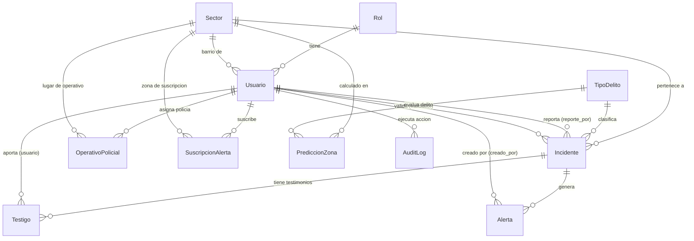

# Documentación de la Estructura de la Base de Datos

Este documento detalla el esquema de base de datos relacional para el sistema **Santa Cruz Segura Predictiva**, especificando tablas, columnas, tipos de datos, llaves (primarias/foráneas) y las relaciones entre ellas.

---

## 📊 Diagrama Entidad-Relación (Mermaid)

El siguiente diagrama visualiza cómo están conectadas las tablas del sistema:



---

## 🗂️ Detalle de Tablas

### 1. Tabla: `usuarios_rol` (Roles del Sistema)
Almacena los roles predefinidos que definen los niveles de acceso.
* **Roles predefinidos:** `Administrador`, `Administrador de Junta`, `Policía`, `Vecino`.

| Campo | Tipo | Nulo | Descripción |
| :--- | :--- | :--- | :--- |
| `id` (PK) | INT (AutoIncrement) | No | Identificador único del rol. |
| `nombre` | VARCHAR(50) | No | Nombre único del rol. |

---

### 2. Tabla: `usuarios_usuario` (Usuarios/Cuentas)
Entidad que representa las cuentas de usuario de la plataforma. Hereda campos de seguridad estándar de Django (como contraseña hasheada, estado del sistema, etc.).

| Campo | Tipo | Nulo | Descripción |
| :--- | :--- | :--- | :--- |
| `id` (PK) | INT (AutoIncrement) | No | Identificador único del usuario. |
| `username` | VARCHAR(150) | No | Nombre de usuario único para inicio de sesión. |
| `password` | VARCHAR(128) | No | Hash seguro de la contraseña. |
| `email` | VARCHAR(254) | Sí | Correo electrónico de contacto. |
| `first_name` | VARCHAR(150) | Sí | Nombre(s) del usuario. |
| `last_name` | VARCHAR(150) | Sí | Apellido(s) del usuario. |
| `is_staff` | TINYINT(1) | No | Flag para acceso al panel de administración de Django. |
| `is_superuser`| TINYINT(1) | No | Flag con todos los permisos del sistema. |
| `date_joined` | DATETIME | No | Fecha de registro en el sistema. |
| `rol_id` (FK) | INT | Sí | Relación con `usuarios_rol` (permisos y rol). |
| `telefono` | VARCHAR(20) | Sí | Teléfono celular o fijo del usuario. |
| `estado` | VARCHAR(20) | No | Estado de cuenta: `activo`, `inhabilitado`, `bloqueado`. |
| `intentos_fallidos` | INT | No | Contador de intentos de login fallidos (seguridad de bloqueo). |
| `reportes_falsos_mes` | INT | No | Contador de reportes validados como falsos creados por el usuario en el mes actual. |
| `barrio_id` (FK)| INT | Sí | Relación con `incidentes_sector` (barrio al que pertenece el vecino). |

---

### 3. Tabla: `incidentes_sector` (Sectores y Barrios de la Ciudad)
Almacena la lista de barrios registrados en el sistema con sus coordenadas geográficas centrales para geolocalización por GPS.

| Campo | Tipo | Nulo | Descripción |
| :--- | :--- | :--- | :--- |
| `id` (PK) | INT (AutoIncrement) | No | Identificador único del sector. |
| `nombre` | VARCHAR(100) | No | Nombre único del barrio o sector (ej. *Equipetrol*, *Plan 3000*). |
| `centro_lat` | DECIMAL(10, 8) | Sí | Latitud central para geolocalización automática. |
| `centro_lon` | DECIMAL(10, 8) | Sí | Longitud central para geolocalización automática. |

---

### 4. Tabla: `incidentes_tipodelito` (Categoría de Delitos)
Almacena el catálogo de delitos disponibles en el sistema (ej. *Hurto*, *Asalto a mano armada*, *Vandalismo*).

| Campo | Tipo | Nulo | Descripción |
| :--- | :--- | :--- | :--- |
| `id` (PK) | INT (AutoIncrement) | No | Identificador único del delito. |
| `nombre` | VARCHAR(100) | No | Nombre único de la tipología delictiva. |

---

### 5. Tabla: `incidentes_incidente` (Reportes de Delitos)
Almacena la información de los incidentes reportados en la plataforma.

| Campo | Tipo | Nulo | Descripción |
| :--- | :--- | :--- | :--- |
| `id` (PK) | INT (AutoIncrement) | No | Identificador único del reporte. |
| `titulo` | VARCHAR(150) | No | Título breve y descriptivo del suceso. |
| `descripcion` | TEXT | No | Detalles extensos del suceso (hechos, vestimenta, etc.). |
| `latitud` | DECIMAL(10, 7) | No | Latitud del suceso (capturado por GPS o marcador). |
| `longitud` | DECIMAL(10, 7) | No | Longitud del suceso (capturado por GPS o marcador). |
| `direccion` | VARCHAR(255) | No | Dirección descriptiva o aproximada por texto. |
| `fecha_hora` | DATETIME | No | Fecha y hora en la que ocurrió el incidente. |
| `sector_id` (FK)| INT | No | Barrio al que pertenece el reporte (`incidentes_sector`). |
| `tipo_id` (FK) | INT | No | Tipo de delito reportado (`incidentes_tipodelito`). |
| `reporte_por_id` (FK)| INT| Sí | Usuario que creó el reporte (`usuarios_usuario`). |
| `imagen` | VARCHAR(100) | Sí | Ruta del archivo de evidencia fotográfica principal. |
| `activo` | TINYINT(1) | No | Estado lógico (activo/eliminado). |
| `estado` | VARCHAR(20) | No | Estado de validación: `pendiente`, `validado`, `falso`. |
| `validador_id` (FK)| INT | Sí | Administrador de Junta o Superusuario que lo validó. |
| `fecha_hora_validacion`| DATETIME| Sí | Fecha y hora de la validación. |
| `num_testigos`| INT | No | Número de testigos/aportantes confirmados. |
| `reporte_anonimo`| TINYINT(1) | No | Flag para ocultar la identidad del reportero al público. |

---

### 6. Tabla: `incidentes_testigo` (Testimonios y Aportes)
Almacena comentarios o fotos adicionales cargadas por vecinos que presenciaron o apoyan la veracidad de un reporte.

| Campo | Tipo | Nulo | Descripción |
| :--- | :--- | :--- | :--- |
| `id` (PK) | INT (AutoIncrement) | No | Identificador único del testimonio. |
| `incidente_id` (FK)| INT | No | Reporte principal al que se añade testimonio (`incidentes_incidente`). |
| `usuario_id` (FK)| INT | Sí | Vecino que aporta el testimonio (`usuarios_usuario`). |
| `canal_origen`| VARCHAR(20) | No | Canal de envío: `web`, `whatsapp`, `voz`, `telegram`. |
| `fecha_reporte`| DATETIME | No | Fecha y hora de registro del testimonio. |
| `comentario` | TEXT | Sí | Contenido del testimonio o ampliación de datos. |
| `imagen` | VARCHAR(100) | Sí | Ruta del archivo de foto cargada por el testigo. |
| `reporte_anonimo`| TINYINT(1) | No | Ocultar identidad del testigo al público. |

---

### 7. Tabla: `incidentes_operativopolicial` (Patrullajes Asignados)
Almacena la distribución y programación de operativos policiales y patrullas preventivas en barrios.

| Campo | Tipo | Nulo | Descripción |
| :--- | :--- | :--- | :--- |
| `id` (PK) | INT (AutoIncrement) | No | Identificador único del operativo. |
| `policia_id` (FK)| INT | No | Usuario policía asignado (`usuarios_usuario`). |
| `sector_id` (FK)| INT | No | Barrio asignado para patrullaje (`incidentes_sector`). |
| `fecha` | DATE | No | Fecha del operativo. |
| `hora_inicio` | TIME | Sí | Hora de inicio planificada. |
| `hora_fin` | TIME | Sí | Hora de finalización planificada. |
| `num_agents` | INT | No | Número de oficiales asignados. |
| `zona_asignada`| VARCHAR(200) | Sí | Sub-zona específica o cuadrante del barrio. |
| `notas` | TEXT | Sí | Indicaciones, órdenes de patrullaje o reporte. |
| `fecha_registro`| DATETIME | No | Timestamp de registro. |

---

### 8. Tabla: `alertas_alerta` (Notificaciones/Alertas Generadas)
Almacena las alertas preventivas enviadas por el sistema cuando se valida un delito grave en una zona.

| Campo | Tipo | Nulo | Descripción |
| :--- | :--- | :--- | :--- |
| `id` (PK) | INT (AutoIncrement) | No | Identificador único de la alerta. |
| `incidente_id` (FK)| INT | No | Incidente de origen que disparó la alerta (`incidentes_incidente`). |
| `mensaje` | VARCHAR(250) | No | Texto descriptivo de la alerta de seguridad. |
| `fecha` | DATETIME | No | Fecha y hora de envío de la alerta. |
| `leido` | TINYINT(1) | No | Flag para leer notificaciones Web. |
| `creado_por_id` (FK)| INT | Sí | Sistema o usuario administrador que despachó la alerta. |

---

### 9. Tabla: `alertas_suscripcionalerta` (Configuración de Canales)
Configuración personalizada de alertas para vecinos según su barrio y canales de comunicación externos.

| Campo | Tipo | Nulo | Descripción |
| :--- | :--- | :--- | :--- |
| `id` (PK) | INT (AutoIncrement) | No | Identificador único de suscripción. |
| `usuario_id` (FK)| INT | No | Vecino suscriptor (`usuarios_usuario`). |
| `sector_id` (FK)| INT | No | Sector geográfico al que se suscribe (`incidentes_sector`). |
| `canal_preferido`| VARCHAR(20) | No | Canales preferidos: `whatsapp`, `telegram`, `ambos`. |
| `recibir_predictivas`| TINYINT(1)| No | Recibir avisos preventivos generados por el modelo de IA. |
| `fecha_suscripcion`| DATETIME | No | Fecha y hora de suscripción. |

---

### 10. Tabla: `predicciones_prediccionzona` (Resultados de Inteligencia Artificial)
Almacena los resultados del modelo de machine learning (probabilidades de riesgo estimadas por zona y delito).

| Campo | Tipo | Nulo | Descripción |
| :--- | :--- | :--- | :--- |
| `id` (PK) | INT (AutoIncrement) | No | Identificador único de la predicción. |
| `sector_id` (FK)| INT | No | Barrio de la evaluación (`incidentes_sector`). |
| `tipo_id` (FK) | INT | No | Tipo de delito evaluado (`incidentes_tipodelito`). |
| `probabilidad` | DOUBLE | No | Probabilidad de riesgo calculada (entre 0.00 y 1.00). |
| `fecha` | DATETIME | No | Fecha y hora en la que se generó la predicción. |

---

### 11. Tabla: `predicciones_modeloia` (Logs de Entrenamiento de Modelos)
Control y auditoría del entrenamiento del modelo Scikit-Learn.

| Campo | Tipo | Nulo | Descripción |
| :--- | :--- | :--- | :--- |
| `id` (PK) | INT (AutoIncrement) | No | Identificador único de versión del modelo. |
| `version` | VARCHAR(50) | No | Versión del modelo (por ejemplo, *1.0*, *1.2*). |
| `fecha_entrenamiento`| DATETIME | No | Fecha y hora de entrenamiento del modelo. |
| `precision_obtenida`| DECIMAL(5, 2)| Sí | Score de precisión R2 o exactitud obtenido. |
| `registros_usados`| INT | No | Cantidad de incidentes históricos utilizados. |
| `estado` | VARCHAR(20) | No | Estado del modelo: `activo`, `inactivo`, `descartado`. |
| `ruta_archivo` | VARCHAR(255) | Sí | Ubicación física del archivo serializado (`.pkl`). |

---

### 12. Tabla: `auditoria_auditlog` (Logs de Seguridad)
Bitácora de seguridad del sistema que audita las acciones críticas realizadas por los usuarios (cambio de roles, validaciones, creación de cuentas).

| Campo | Tipo | Nulo | Descripción |
| :--- | :--- | :--- | :--- |
| `id` (PK) | INT (AutoIncrement) | No | Identificador único del registro de auditoría. |
| `usuario_id` (FK)| INT | Sí | Usuario que realizó la acción (`usuarios_usuario`). |
| `fecha` | DATETIME | No | Fecha y hora en que ocurrió el suceso. |
| `accion` | VARCHAR(200) | No | Nombre de la acción ejecutada (ej. *Modificación de estado*). |
| `modelo` | VARCHAR(100) | No | Nombre de la tabla afectada. |
| `registro_id` | INT | Sí | ID numérico del registro modificado. |
| `detalles` | TEXT | Sí | Información de cambios en formato de texto (valor anterior/nuevo). |
| `ip_origen` | VARCHAR(45) | Sí | Dirección IP de origen (soporta IPv4 e IPv6). |

---

## 🗃️ Respaldos y Restauraciones Manuales

El sistema realiza respaldos automáticos, pero se pueden hacer operaciones directamente sobre la base de datos MySQL local con los siguientes comandos:

### Respaldar Base de Datos (SQL Dump)
Ejecutar desde la consola de Windows (CMD) teniendo agregada la carpeta `bin` de MySQL en el PATH:
```cmd
mysqldump -u santacruz -pTuPasswordSeguro -h 127.0.0.1 santa_cruz_segura > respaldo_manual.sql
```

### Restaurar Base de Datos
1. Crear una base de datos limpia:
   ```sql
   DROP DATABASE IF EXISTS santa_cruz_segura;
   CREATE DATABASE santa_cruz_segura CHARACTER SET utf8mb4 COLLATE utf8mb4_unicode_ci;
   ```
2. Importar el archivo SQL:
   ```cmd
   mysql -u santacruz -pTuPasswordSeguro -h 127.0.0.1 santa_cruz_segura < respaldo_manual.sql
   ```
